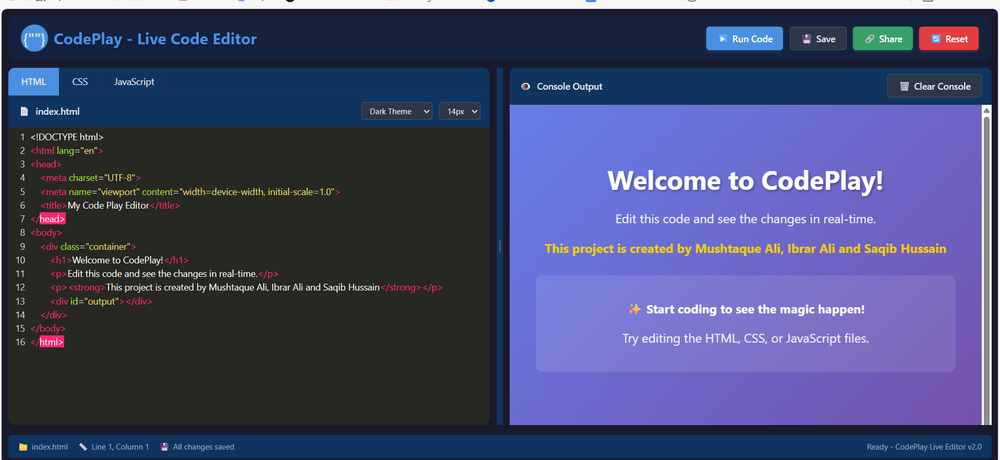
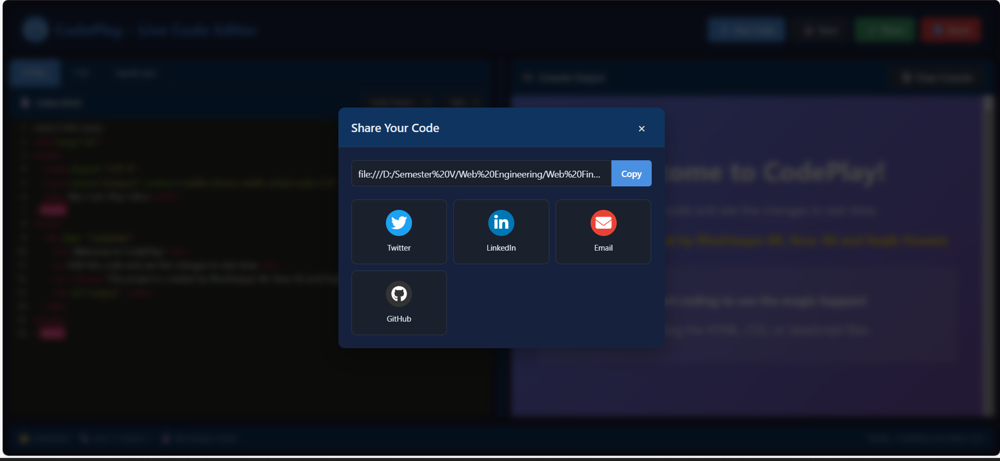

# CodePlay – Live Code Editor 🚀

## Web Engineering Final Project

CodePlay is a web-based Live Code Editor that allows users to write and preview HTML, CSS, and JavaScript code in real time.  
This project is developed as part of the Web Engineering (Semester V) Final Project.

---

## Project Overview

CodePlay provides an interactive coding environment where users can:
- Write HTML, CSS, and JavaScript code
- Instantly see the output
- Experiment with front-end development concepts easily

---

## Technologies Used
- HTML5
- CSS3
- JavaScript

---

## Features
- Separate editors for HTML, CSS, and JavaScript
- Real-time live preview
- Dark theme interface
- Run Code button
- Save and Reset options
- Console output panel
- Responsive design

---

## Output / Screenshot

---

## How to Run the Project

## 🌐 Live Demo
You can view and use the live version of this project here:

👉 [Live Code Editor (HTML, CSS & JS)](https://mrmushtaq.github.io/Web-Engineering-Project-Live-Code-Editor-of-HTML-CSS-JS/)

